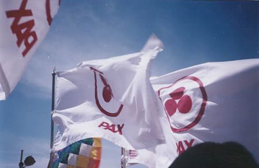

  
  <h1 align="center"> Geounity   </h1>

  Debates entre comunidades y personas del mundo.

## El simbolo de la paz

El logo de la Bandera de la Paz, son tres esferas de color magenta, formando un triángulo con el vértice hacia arriba, rodeadas por un círculo del mismo color sobre fondo blanco.

Su iniciador fue el ilustre artista [Nicolás Roerich (1874—1947)](http://www.banderadelapaz.org/bandera/roerich_biografia.shtml), quien escogió este antiquísimo símbolo de Unidad y Paz, por su significación y aceptación universales, ya que aparece en casi todas las culturas y religiones, y es respetado por todas ellas.

A través de este logo arcano, podemos conectar con los arquetipos más profundos de paz, inscritos en la psique humana, lo que estimula su aprendizaje y utilización. De ahí su gran fuerza.

More info [here](http://www.banderadelapaz.org/).

> "La voluntad de que la paz reine en la tierra tiene su símbolo en la Bandera de la Paz. En este artículo se aborda su significado Trino, y se describen las pautas para que cada persona pueda convertirse en una expresión viviente de este logo."

### TRANSFORMARSE EN BANDERA DE PAZ
*[POR ALICIA RODRÍGUEZ](http://www.banderadelapaz.org/bandera/transformarse.shtml)*

Una gran mayoría de la población mundial y en general todos aquellos que ya han encontrado su sendero espiritual, desean fervientemente que la Paz reine en toda la Tierra. Pero muchos de nosotros no somos concientes de que nuestros pensamientos desarmónicos, depresiones, resentimientos, angustias y falta de perdón son, en parte causantes de la frecuencia vibratoria deagresividad y polución mental en la que se encuentra nuestro planeta.

Por eso resulta de gran interés que realicemos un examen de conciencia para saber que puede convertirnos en seres culpables de guerra. El triángulo prodigioso del símbolo arcano de la Bandera de la Paz, puede ayudar a detectar los síntomas de este estado.

La Bandera de la Paz tiene en su logo uno de los símbolos más poderoso y de más profundo significado tanto esotérico como exotérico. Los que sólo están capacitados para ver la forma externa de los símbolos, la Bandera de la Paz representa un mensaje estático. Esta percepción refleja en buena medida el hecho de estar anclado en los aspectos materiales de la vida de quien la contempla. Esta interpretación se ajusta también a la de las personas que no tienen la capacidad de comprender la urgente necesidad que existe entre todos los habitantes del planeta Tierra de vibrar en la misma frecuencia de amor, tolerancia y respeto.

Pero, afortunadamente, hoy también existe en el mundo un gran movimiento espiritual de hombres y mujeres de la Nueva Era que no se conforman únicamente con lo que ven o tocan, o con las posesiones materiales. Ellos han decidido hacer realidad el precepto de Delfos: ”Hombre, conócete a ti mismo”, y en su diario vivir expresan en todos los ámbitos el deseo de conocerse más profundamente, y tras limpiarse del odio, la cólera, el resentimiento y el miedo, ”alcanzan” el contacto con su ser interno. Este tipo de personas comprenden el aspecto esotérico de los mensajes que nos están siendo trasmitidos a través de los símbolos y entienden que la Bandera de la Paz es un símbolo viviente aglutinador de voluntades, pensamientos, esfuerzos y acciones.

### La Ley del Triángulo

Como bien es sabido, los humanos estamos regidos tanto por las Leyes del plano terrenal como por las Leyes Cósmicas. En este sentido, es necesario comprender que para lograr la realización de cualquier meta es indispensable actuar en concordancia con una de las más importantes Leyes Cósmicas: la Ley del triángulo.

Para lograr la Paz en el individuo y luego en la colectividad es necesario trabajar en armonía con esta Ley. Es así, como cada día se deben vivir las tres esferas del Logo de la Bandera de la Paz con pensamientos positivos, palabras armoniosas y acciones constructivas. la forma en que cada uno de nosotros puede convertirse en una Bandera de la Paz viviente se resume en los siguientes tres pasos:

#### 1- La esfera del pensamiento
Prestar mucha atención a nuestros pensamientos. Si estamos conscientes de que los pensamientos son patrones de electrones pondremos más cuidado en nuestra creación mental. Y si en este ejercicio descubrimos algunos pensamientos negativos, debemos proceder a sustituirlos por pensamientos de armonía y amor: primero hacia nosotros mismos y después hacia los demás.

**Ama a tu prójimo, como a ti mismo:** nos dice claramente que para poder amar a los demás, primeramente hemos de amarnos a nosotros mismos. De la misma manera, para lograr la paz mental y emocional, debemos perdonar no sólo a los demás sino lograr el perdón más difícil: el perdón hacia nosotros mismos por todos los errores cometidos. Al amarnos y perdonarnos, nos sentimos merecedores de los dones que nos corresponden como hijos de la creación.

Analicemos, pues, la calidad positiva o negativa de nuestros pensamientos e identifiquemos que pensamientos nos hacen culpables de guerra. Este es el primer paso para empezar a aplicar en nuestra vida el símbolo de la Bandera de la Paz, equivalente a la primera esfera magenta. la esfera del Pensamiento.

#### 2- La esfera de la palabra

Procederemos pues a poner atención sobre nuestras palabras en un intento por lograr la Paz Profunda a través del Logo de la Bandera de la Paz. Observemos que al hablar estamos muy inclinados a la negatividad. Nos consideramos torpes, indignos de la prosperidad, de la iluminación. Malgastamos el tiempo de nuestras conversaciones en la crítica. El Maestro Jesús fue bien claro en el cuidado que debemos tener en lo que hablamos: ”No le hace daño al hombre lo que entra por la boca, sino lo que sale de ella”. Para vivir la segunda punta del triángulo en armonía, debemos retirar de nuestro léxico las frases, *no puedo, no lo merezco o soy incapaz*. Pensemos con humildad, contra quién nos ponen en guerra nuestras palabras.

#### 3- La esfera de la acción
La esfera que aparece en el vértice superior del Logo de la Bandera de la Paz. Es la tercera punta del triángulo para lograr la anhelada Paz Profunda. Está representada por nuestras acciones. ¿Son estas congruentes con nuestros pensamientos y nuestras palabras? ¿O pensamos una cosa, decimos otra muy diferente y actuamos en total desarmonía con nosotros mismos, convirtiéndonos en seres desintegrados?

## Encrucijada Planetaria
En este momento crucial para el planeta, podemos tomar dos caminos, el de la regeneración para acércanos a nuestra fuente divina, o el de la incongruencia y la desintegración. Es nuestra propia responsabilidad decidir cual tomamos. Si decidimos dar un paso adelante para lograr nuestra paz interna, el símbolo arcano de la Bandera de la Paz abrirá una puerta hacia el logro de nuestra meta. Pero debemos dejarlo verlo como algo estático o externo.

Si comprendemos que nosotros somos la Bandera misma y aplicamos la Ley del triángulo en nuestras vidas, ordenando nuestros pensamientos desde nuestro Ser Superior, habremos contribuido de una manera positiva a la Paz Universal, y a las palabras recibidas por Nicholas Roerich, de la Gran Jerarquía: ”Pax Cultura”, cobrarán su verdadero significado gracias a cada uno de nosotros”.

  <h2 align="center">La llamada a la Bandera de la Paz</h2>
  
Aquiétate, armonizate en el silencio de tu ser interno.

  
Escucha tu propia voz. En ella encontrarás la clave para no seguir por más tiempo a la deriva.

  
No puedes continuar ignorando para qué naciste: ¿Para qué estás en el plano?

  
¿Hacia donde vas?

  
Aprende a vivir aquí y ahora.

  
Vive en el equilibrio que trae la paz interna.

  
La paz es la actitud de la no fricción, del no conflicto.

  
Fluye en perfecta armonía con la corriente positiva de la Mente Universal y acabaran las luchas.

  
Perdónate y perdona.

  
Entra en comunión con el Silencio.

  
Entra en contacto con el Uno-Todo.

  
Vive libre de obstáculos, para dejar que Dios se manifieste en ti.

  
¡Levántate! Resurge de las cenizas y conviértete en Paloma mensajera de la Paz.

  
Lleva el mensaje de la Paz a todo el que te escuche.

  
Fluye en perfecta armonía con la corriente positiva de la Mente Universal y acabaran las luchas.

  

> La Paz en el Planeta debe comenzar en cada individuo, en el corazón de cada hombre, y así la Paz Cultura vibrará en su más alta frecuencia.